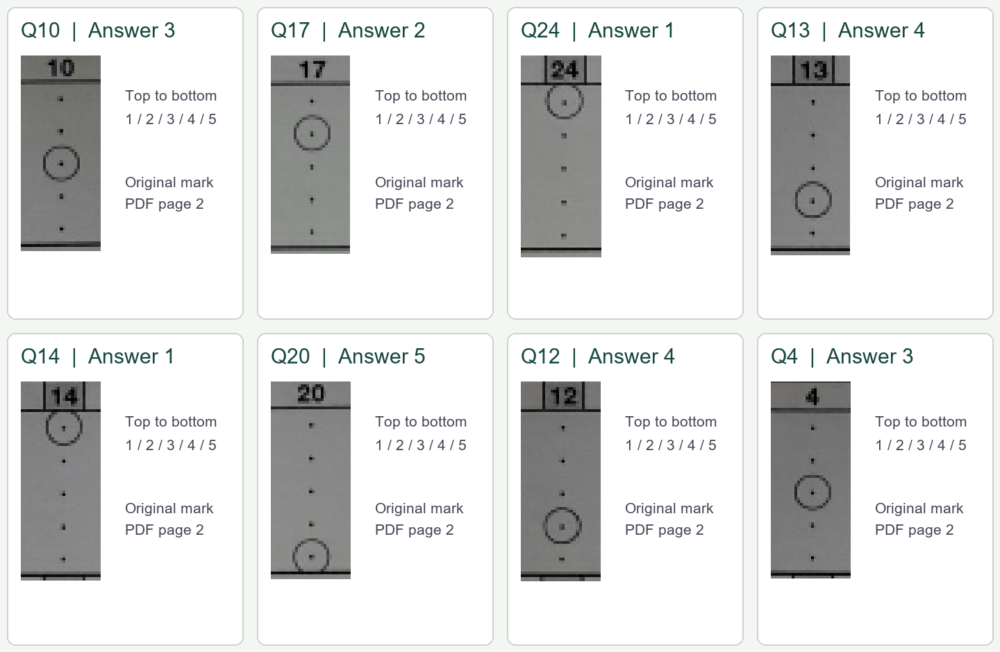
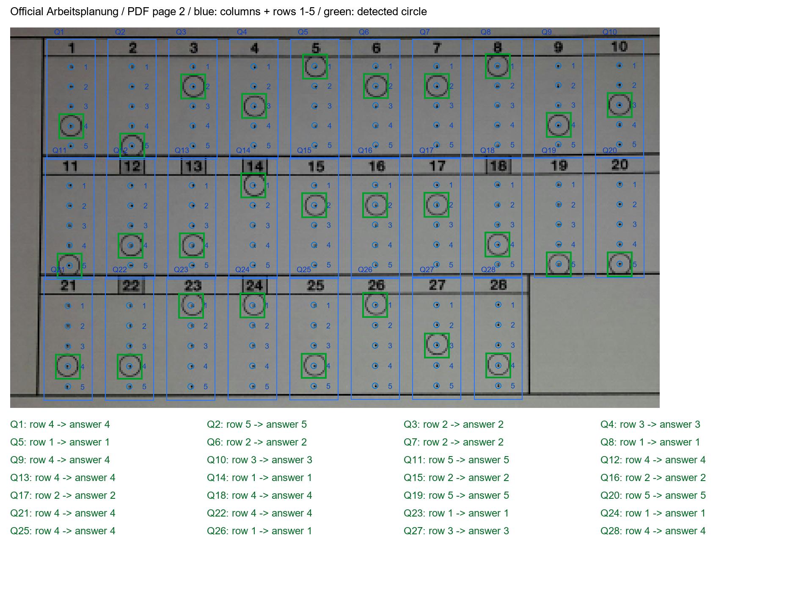
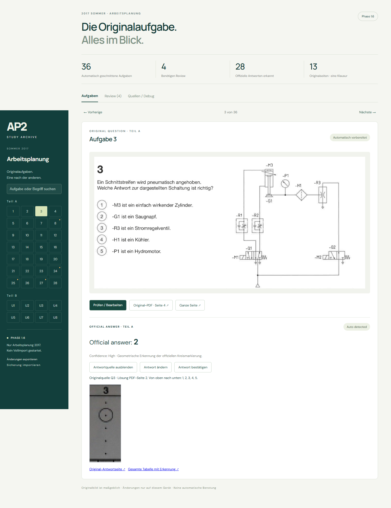

# Phase 1.6 验收报告 — Official Answer Key Extraction

本阶段只处理 **2017 Sommer Arbeitsplanung Teil A，Q1–Q28，官方 Lösung 的物理 PDF 第 2 页**。保留 Phase 1.5 全部题目 ID、segmentation 数据和裁剪。没有运行全量扫描，没有提取其他年份、Funktionsanalyse、WiSo 或 U1–U8 的答案。

## 识别结果

- **28 道官方选择题答案自动识别，28 道 auto_ready。**
- **答案 Needs Review：0 道，无缺题、无重复答案、无越界答案。**
- Q1–Q28 每题恰有一个来自实际圆圈的答案，均在 1–5 内，均有可打开的来源裁剪和 PDF 页链接。
- 原有 segmentation 的 4 个 Review（Q8、Q24、Q25、Q27）不被自动清除。这些是题号/裁剪问题，与本阶段答案圈选识别分开显示。
- 所有答案都来自图像几何；没有通过题意、OCR 答案文字或 LLM 推理推断正确选项。

| 题号 | 答案 | 题号 | 答案 | 题号 | 答案 | 题号 | 答案 |
|---|---|---|---|---|---|---|---|
| 1 | 4 | 8 | 1 | 15 | 2 | 22 | 4 |
| 2 | 5 | 9 | 4 | 16 | 2 | 23 | 1 |
| 3 | 2 | 10 | 3 | 17 | 2 | 24 | 1 |
| 4 | 3 | 11 | 5 | 18 | 4 | 25 | 4 |
| 5 | 1 | 12 | 4 | 19 | 5 | 26 | 1 |
| 6 | 2 | 13 | 4 | 20 | 5 | 27 | 3 |
| 7 | 2 | 14 | 1 | 21 | 4 | 28 | 4 |

## 检测方法与边界

官方表为三组列：1–10、11–20、21–28。顶端小字号 OCR 在试验中有误读，因此最终解析器**不依赖 OCR**：使用一次视觉核对、绑定这份 PDF 精确 SHA256 的列编号/坐标模板。模板只含题号范围与位置，不含任何正确答案。

来源 SHA256：`1bca5421b9553e59df7103d82bfa3bbb45243009b2e09bcd9c4f3904fe1d9bd4`。

每列按从上到下明确编号 1、2、3、4、5。分别检查中心小点、环带墨迹比例和 12 个角度扇区的覆盖，要求五个位置结构明确、唯一明显圆圈、与其他候选有足够差距。没有唯一圆圈时答案为 `null`，状态为 `needs_review`，不猜测。

`confidence=0.98 / High` 是满足严格几何规则的等级，**不是经过校准的统计概率**。这次是在已核对模板上的自动圈选识别，不宣称能无配置识别任意答案页。

原答案裁剪从 PDF 以 300 DPI 渲染，包含题号与全部五个位置。`answer_bbox` 是 PDF 点坐标、左上角为原点；另存 `circle_bbox` 和五个候选位置的测量。裁剪保留原像素，不重绘圈选标记。

## 随机八题

从全部 28 题使用固定随机种子 `1602017` 不放回抽取，顺序为 Q10、Q17、Q24、Q13、Q14、Q20、Q12、Q4。该样本覆盖了答案 1–5。[抽样记录](evidence/phase16/samples.json)。

| 题号 | 自动答案 | 官方来源 |
|---|---|---|
| Q10 | 3 | Lösung 第 2 页，题号 10 下第 3 个位置 |
| Q17 | 2 | Lösung 第 2 页，题号 17 下第 2 个位置 |
| Q24 | 1 | Lösung 第 2 页，题号 24 下第 1 个位置 |
| Q13 | 4 | Lösung 第 2 页，题号 13 下第 4 个位置 |
| Q14 | 1 | Lösung 第 2 页，题号 14 下第 1 个位置 |
| Q20 | 5 | Lösung 第 2 页，题号 20 下第 5 个位置 |
| Q12 | 4 | Lösung 第 2 页，题号 12 下第 4 个位置 |
| Q4 | 3 | Lösung 第 2 页，题号 4 下第 3 个位置 |

## 全答案表检测 overlay

蓝框为题号列；蓝色数字明确标出五个候选位置 1–5；绿色框为检测出的原始圆圈。下方逐题列出 `row n → answer n`，用于发现整体错行。

## 网页与人工修正

[线上逐题页面](https://neroclaud2015.github.io/AP2/?q=3) 显示 `Official answer`、`Auto detected`、`Confidence: High`，支持：

- **Offizielle Antwortquelle ansehen**：显示该题号及五个位置的原始裁剪，可回到 Lösung PDF 第 2 页，也可打开完整 overlay。
- **Antwort ändern**：只选择 1、2、3、4、5，无需输入答案文字。
- **Antwort bestätigen**：确认并锁定当前答案。高置信度自动答案不要求逐题确认。
- 修改后 `user_corrected=true`、`locked=true`；确认后独立标记 `confirmed`，不改变题目裁剪的确认状态。
- 人工答案单独保存在 IndexedDB v3 的 `answerReviews`，优先于机器答案；不会写入公开静态数据。
- 来源页字段 `solution_source_page=2` 与 `official_answer_type=multiple_choice`、`official_answer`、`official_answer_status` 分离。旧 `solution_page` 仅表示来源关联，不能作为答案值。
- 备份格式 v2 同时导出题目修改与答案修改；可导入 v1 旧备份，并保留已有答案锁定。导入期间禁止编辑，格式无效则不写入。

## 断点、版本与“不覆盖”证据

- 独立 manifest：`data/ingest/answer_manifest.json`。
- parser：`1.6.0`；完整 revision：`1.6.0-d35145e170f1`。
- 处理键包含 **solution PDF SHA256 + parser version + page/layout config SHA256**。
- 第一轮保存第 2 页 checkpoint 后主动中断；第二轮复用 checkpoint 完成导出，处理 PDF 页数为 **0**；第三轮状态 `skipped`，处理页数为 **0**。
- 恢复/跳过验证中将 PDF 打开操作替换为抛错，测试仍通过，证明没有偷偷重新读取 PDF。[恢复与跳过证据](evidence/phase16/resume-skip.json)。
- 浏览器测试把 Q3 改为 5，刷新后仍为 5；真实 parser 再运行返回 skipped 后仍为 5；再模拟新 parser 版本/机器答案改为 1，人工锁定仍保持 5。所有修改仅发生在测试浏览器隔离环境，不改变官方机器数据。[浏览器证据](evidence/phase16/browser.json)。
- 断点完成时校验裁剪/overlay 内容哈希；缺失或损坏则仅恢复指定答案页。JSON 使用规范化内容哈希，Windows/CI 的 CRLF/LF 差异不会触发重复处理。
- 调整解析算法须提升 parser version；调整布局会改变 config hash。旧版记录保留，只处理显式限定的目标页；没有目录扫描、年份参数或全量模式。
- 原 ingestion/segmentation manifests、36 个 question IDs、原始文件及题目裁剪与 `5b5958f` 基线一致。[范围完整性证明](evidence/phase16/scope-integrity.json)。

## 验证清单

| 验证项 | 结果 |
|---|---|
| Q1–Q28 唯一答案，范围 1–5，来源存在 | 通过，28/28 |
| 顶部 row 1 与底部 row 5 映射 | 合成测试及实际 overlay 核对通过 |
| 无圈、双圈、缺点、错位、横线、题号不确定 | 均拒绝猜测，进入 needs_review |
| 原题 36 张裁剪与编辑功能 | 浏览器回归通过 |
| 28 张答案来源裁剪与 PDF 页链接 | 浏览器全部打开通过 |
| 人工修改刷新持久化/新机器版本不覆盖 | 通过 |
| 实际 parser 重跑不覆盖人工答案/完成页跳过 | 通过，重处理 0 页 |
| 备份恢复、慢速导入防竞争、无效备份无写入、旧格式兼容 | 通过 |
| IndexedDB v2 → v3 保留已有题目修改 | 通过 |
| parser/layout 版本失效、损坏产物恢复、JSON 换行稳定性 | 通过 |
| Python 全套测试 | 20 通过 |
| 前端存储测试 | 4 通过 |
| 生产构建、原数据/segmentation/答案数据校验 | 通过 |
| 桌面/移动端、浏览器错误 | 无横向溢出、无页面错误 |

独立代码审查发现的“备份读取期间编辑竞争”已先复现、再修复并回归。自动部署流程只验证保存的数据和构建网站，不执行真实 ingestion、segmentation 或 answer parser。

## 仍不能可靠自动处理的情况

1. 新 PDF 哈希、不同页序或不同版式：必须先核对对应模板；当前解析器拒绝未知来源。
2. 严重倾斜、缩放、遮挡或扫描缺失导致五个位置不明确：进入 Review，不能套用旧行号猜答案。
3. 没圈、两个圈、擦除/模糊标记、其他涂写使圆圈不唯一：答案保持 null。
4. 题号无法确认或缺列/重复列：不能为凑足 28 题而推断；需要重新核对模板/来源。
5. U1–U8、文字答案、多选、不同选项数及其他模块/年份：本阶段未实现、未处理。

**完成本阶段后停止，等待用户验收；不启动任何全量历史试卷导入。**
