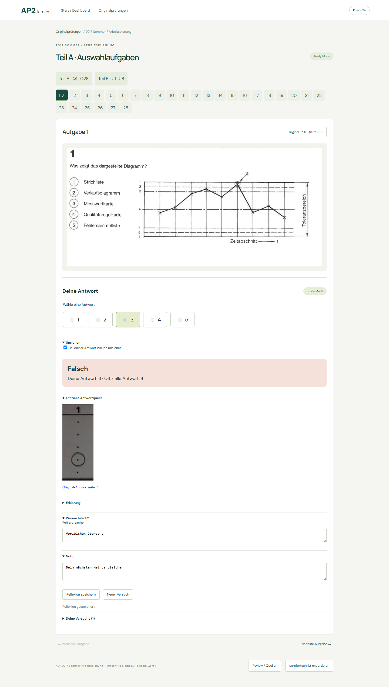
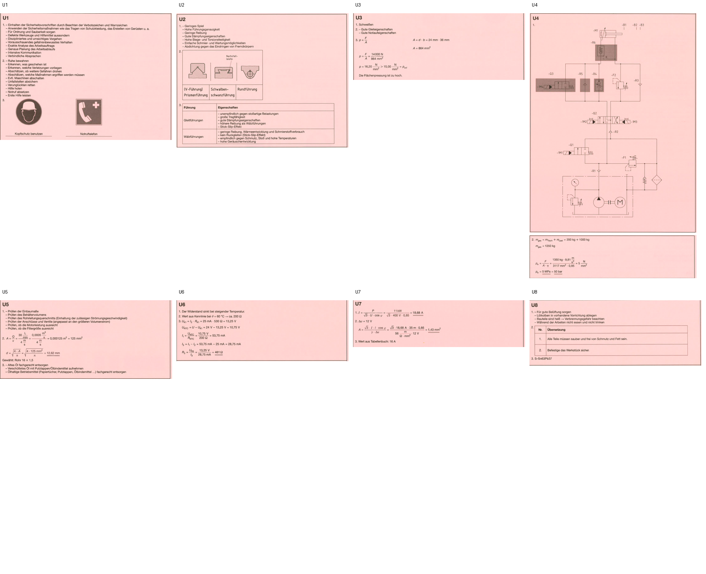

# Phase 2A 验收报告 — Learning UX + U-Question Answer Model

范围：**2017 Sommer Arbeitsplanung**。原有 36 道题的 ID、segmentation、题目裁剪和 28 道选择题官方答案保持不变。本阶段新增正常学习流程、个人学习进度，以及 U1–U8 的官方答案裁剪。没有处理其他年份、Funktionsanalyse、WiSo，也没有进入知识点系统。

## 直接演示

- [Start / Dashboard](https://neroclaud2015.github.io/AP2/?view=start)
- [Originalprüfungen](https://neroclaud2015.github.io/AP2/?view=exams)
- [Q1 答题](https://neroclaud2015.github.io/AP2/?view=study&q=1)：选 3 → Antwort abgeben → Falsch；新建一次尝试后选 4 → Richtig。官方答案来自 Phase 1.6 已验证的圈选来源。
- [U1 填写与自评](https://neroclaud2015.github.io/AP2/?view=study&q=U1)：按三个小问填写 → Lösung anzeigen → 原始官方解答截图 → 每个小问选择 richtig / teilweise richtig / falsch → Bewertung speichern。
- [U7 数值示例](https://neroclaud2015.github.io/AP2/?view=study&q=U7)：第一小问输入 `18,69`，单位固定为 A，显示数值检查 Richtig；官方值为 `18,68 A`，练习容差为 `±0,02 A`。小问最终评价仍由用户选择。

所有浏览器演示使用隔离测试环境，不写入用户现有的个人学习记录。

## 十项验收

| 要求 | 结果与证据 |
|---|---|
| 1. Q1 选择答案并提交，显示 Richtig/Falsch | 已实测错误选项 3 和正确选项 4；保存为两次独立尝试 |
| 2. 查看官方选择题答案来源 | 提交后可展开 Offizielle Antwortquelle，显示原始圈选列并链接 Lösung 第 2 页 |
| 3. Study / Review 明确分开 | Study 无 Antwort bestätigen；Review 才提供答案核验与题目编辑 |
| 4. 不依赖 Debug 返回主页面 | 顶部持续提供 Start / Dashboard、Originalprüfungen，另有 Teil A/B 导航 |
| 5. U1 打开原题 | 使用原有稳定 ID 和原题裁剪 |
| 6. U1 填写答案 | 三个小问独立输入，草稿自动保存，刷新保留 |
| 7. Lösung anzeigen 展示原始解答 | 显示从官方 PDF 第 6 页右侧裁出的完整 U1，含两个标志图 |
| 8. 用户自行评价 | 三个小问分别评价；测试 richtig / teilweise / falsch，整题汇总为 teilweise |
| 9. 数值型小问自动判定 | U7.1 支持小数点/逗号、固定单位和显式容差；空值/非法数字不判对 |
| 10. 刷新保留进度 | 选择题结果、U 草稿、U 逐小问评价、备注和不确定标记均验证持久化 |

[完整浏览器验收记录](evidence/phase2a/browser.json) · [导航与慢速存储回归](evidence/phase2a/navigation-regressions.json)

## 学习流程与数据分离

默认首页为 Dashboard，展示已练习题数、最近正确题数、不确定题数和尝试次数。Originalprüfungen 只列本次模块，进入后可切换 Teil A Q1–Q28 / Teil B U1–U8。Review / Quellen 位于辅助入口。

选择题先作答，再揭示结果。可展开官方来源、Erklärung、Warum falsch?、Unsicher 和 Notiz；错误原因与反思可单独保存。当前没有自动生成逐题专业解释，解释区明确说明这一点，并提供个人说明入口，不伪造解释。通用提示使用情况会被记录。

IndexedDB v4 新增独立的 `attempts` 和 `learningSessions`，保留已有题目 Review、官方答案修正与旧进度表。每次正式提交记录：

- `question_id`、`attempt_id`、`timestamp`、`user_answer`；
- `correctness`、`partial_status`、`confidence` / `unsure`；
- `hints_used`、`error_reason`、`note`；
- `self_assessed` / `auto_scored`、逐小问 `subparts`；
- 当时的官方答案快照与来源版本，避免未来官方键修正悄悄改变历史成绩。

新尝试追加记录，不覆盖旧答案和成绩。反思更新仅限备注、错误原因和不确定状态。提供“Lernfortschritt exportieren”；数据不写入静态题库、不上传服务器。本版未提供学习进度备份导入或跨设备同步。

草稿保存完成前暂时禁用题目/页面切换；浏览器后退会等待写入完成。Review 的未保存编辑状态也传递到外层导航。离开 Review（包括浏览器后退）会先刷新个人官方答案修正，再允许学习判分。

## U1–U8 官方来源

源文件为既有 Lösung PDF，SHA256：`1bca5421b9553e59df7103d82bfa3bbb45243009b2e09bcd9c4f3904fe1d9bd4`。

该 PDF 是拼版，左右半页可能属于不同模块，同名 U 编号会重复。因此本阶段先核对原题内容、模块页眉、连续印刷页 3–7 和题号，再建立绑定源文件哈希的区域模板。没有仅凭 U 编号关联，也没有提取相邻 Funktionsanalyse 的答案。

| 题目 | 物理 PDF 来源页与区域 | 学习模型 |
|---|---|---|
| U1 | 第 6 页右侧 | 3 个 short_text 小问 |
| U2 | 第 7 页左上 | 3 个 short_text 小问，官方表格/图形保留 |
| U3 | 第 7 页左下 | 3 个 short_text 小问，计算过程由用户比较 |
| U4 | 第 8 页右侧 + 第 9 页左上 | drawing + short_text；完整液压图与计算合成 |
| U5 | 第 9 页左侧中上 | 3 个 short_text 小问 |
| U6 | 第 9 页左侧中下 | 3 个 short_text 小问 |
| U7 | 第 9 页左下 | numeric + 2 个 short_text 小问 |
| U8 | 第 9 页右上 | 3 个 short_text 小问 |

共 **8 道 U 题、23 个小问**。图片以 180 DPI 从原 PDF 坐标裁出，原始公式、表格、标志和图纸保留；U4 跨页区域纵向合成并分别提供 PDF 链接。

每题保存 `question_id`、`solution_source_pdf`、`solution_source_page`、`solution_bbox`、带页码的 `regions`、`cropped_solution_image`、`review_status`、小问模型、来源哈希和提取版本。源图是官方事实层；数值字段仅作为有来源证据的辅助检查。

## 数值、自评与 AI 边界

- U7.1 的 `18.68 A` 直接取自可核对的官方截图。`±0.02 A` 是本原型明确标注的练习容差，**不是官方评分细则**。
- 自动数值比较只给出建议，不自动填写 U 题的最终评价。测试中特意将数值检查为 Richtig 的 U7.1 最终选择为 falsch，系统保留了用户决定。
- 每个 U 小问分别保存答案、最终评价和数值建议；整题仅汇总用户已选择的结果。所有小问未评价前不允许保存最终评价。
- drawing / diagram 不自动图像判分。本版可在纸上绘图，点“Auf Papier gezeichnet”并填写说明，查看官方截图后自行评价；没有画板、图像上传或视觉判分。
- 已预留只返回建议的 `AdvisoryEvaluator` 接口，没有接入 AI 服务。AI 接口不持有存储权限，不能写入最终成绩。

## 版本、断点和验证

- 独立提取器：`scripts/u_solutions.py`；版本 `2a.1`，处理键包括源 PDF 哈希、版本和区域/小问配置哈希。
- 独立 manifest：`data/ingest/u_solution_manifest.json`；每个 U 题原子 checkpoint。已有 Phase 1 / 1.5 / 1.6 manifest 不变。
- 从 checkpoint 恢复时禁止打开 PDF，仍可完成导出；完成后再次运行返回 `skipped`，新处理 **0 题**。
- [范围与跳过证据](evidence/phase2a/scope-resume.json)：与 `38c6f94` 基线比较，原始试卷、题目裁剪、全部题目 ID、Teil A 官方答案和旧 manifests 不变。
- Python 全套 **22 项通过**；前端模型/存储 **7 项通过**；生产构建通过。
- Phase 1.5 的 36 张题图、裁剪编辑、导入导出回归通过；Phase 1.6 的 28 道答案来源、人工锁定及异常队列回归通过。
- Q1 / U1 手机视图无横向溢出；浏览器验收无页面错误。
- CI / Pages 只验证已保存数据并构建网站，不运行真实题库提取。

**完成后停止，等待用户验收；不扫描其他年份或模块，不启动知识点系统或全量导入。**
