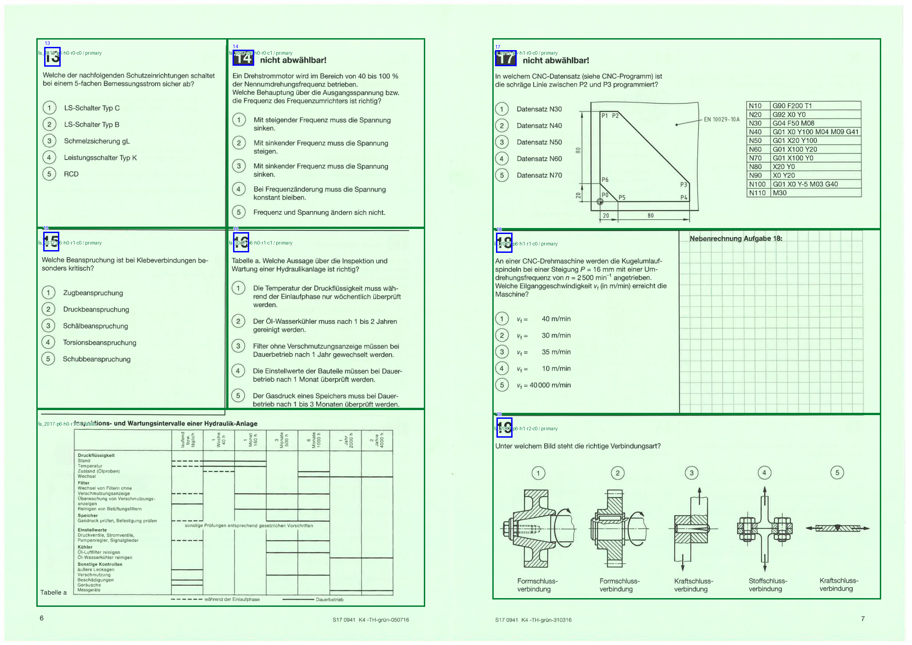
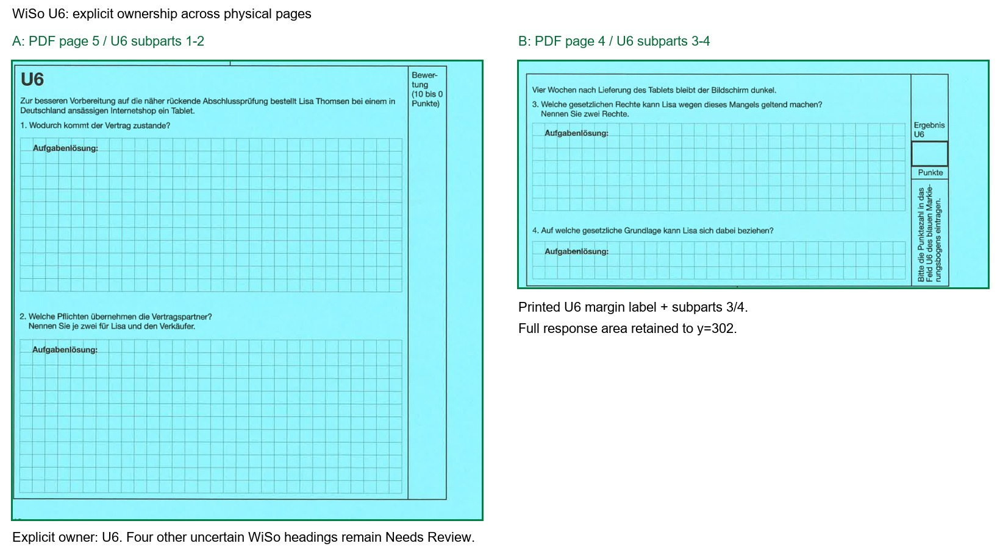

# Phase 2B.1 验收报告

本阶段已完成 Layout Profile 架构重构及三个授权模块的受控兼容性验证。结果是一项通过、两项阻塞。没有启动 Phase 2B 导航、Modultest、知识点系统或其他历史数据扫描。没有新增正式 segmented records；现有学习应用保持不变，静态验收证据将单独发布。

## 模块结果

| 模块 | 全部物理页 | 结论 | 自动检出 / 官方预期 | Review / 阻塞 |
| --- | ---: | --- | --- | --- |
| Sommer 2017 Funktionsanalyse | 15 | Compatible with new profile | 36 / 36：Q1–28、U1–8 | Q9 的单次 OCR 题号证据保留 Needs Review；无缺号、重复或区域重叠 |
| Sommer 2017 WiSo | 9 | Blocked | 20 / 24：预期 Q1–18、U1–6 | Q8、Q9、Q11、U3 的自动题号识别未通过；4 个候选锚点，涉及 2 页 |
| Winter 2017/18 Arbeitsplanung | 25 | Blocked | 0 / 36：预期 Q1–28、U1–8 | 17 个题目/延续内容页需要纵向扫描版式支持；当前未运行未经验证的题号检测器 |

Winter 的 0/36 表示尚未自动验证，不代表原试卷缺题。28+8 来自物理第 2 页的官方说明。三个模块均无重复锚点；WiSo 缺失名单表示未可靠自动识别的题号，不用已知顺序补齐。

## 关键归属证据

### Funktionsanalyse

全部 15 个物理页均已查看。物理页 3–6 包含 Q1–28；页 8–12 包含 U1–8；页 13–15 是图纸、Grafcet 和零件表附件，均保留原始页面并登记 U 题中的明确附件引用。页 1、2、7 为封面/说明，页 8 和 9 还含半页说明/共用情境。

不能直接宣称与 AP 完全兼容：**物理第 6 页的整张液压维护表属于 Q16**。通用网格继承会把左半张表分给 Q15。FA 独立 profile 使用 Q16 正文的表格引用和印刷边界，建立 Q16 主区域＋完整 table 区域；Q15 在表格上方结束。共享边界经过几何互斥校验。其余三行双栏基础布局复用参数化 grid 工具，不依赖 AP profile 的全局配置。

### WiSo

U1 使用独立 panel heading window，不再依赖 AP 的 `top < 60`。它在物理第 4 页、y≈64.58 的题号已自动识别。

**物理第 4 页右上方不是 U1 的延续，而是 U6。** 原页评分栏明确印有 U6，正文是平板购买场景的第 3、4 小问；物理第 5 页左下方是同一 U6 的第 1、2 小问。因此建立：

- 主锚点：`wiso_2017-p5-slot2`，印刷题号 U6。
- primary：物理页 5，bbox `[50, 288, 570, 797]`。
- continuation：物理页 4，bbox `[638, 45, 1170, 302]`，owner 显式指向该锚点。
- y=302 保留延续答题区的底部印刷边框；Q15/Q16 从该边界之后开始。

物理第 7 页没有可用文本层；第 8 页的 Q8/Q9 题号也未从文本层可靠读出。局部 OCR 成功补出部分题号，但 Q11、U3、Q8、Q9 仍未达到规则要求。对应 panel 保留 `owner: null`、Needs Review，不按顺序猜题号，不发布正式记录。第 9 页为 U1 引用附件。

### Winter AP

只读取指定 ZIP 内的 Arbeitsplanung PDF；没有读取其他 Winter 模块或答案 PDF。全部 25 页的 overview 已检查：前 24 页为纵向单页，末页为横向图纸；与 Sommer 横向拼版不同，且缺少嵌入文本层。选择题出现非均匀高度、跨列图形；U5 附近还有跨页流程图，物理页 20 的候选关联保留为未验证信息，未写成确定 owner。没有套用最接近的 Sommer profile，也没有用猜测锚点完成题数。

## 架构与数据兼容

- `segmentation_engine.py`：通用 profile 调度、几何约束及多页 regions 裁剪合成。
- `layout_profiles/base.py`：Region 合同和 profile 身份；`ap_2017.py` 冻结旧 AP 算法；FA/WiSo/Winter 各自独立文件。
- 新区域为 `{page, bbox, role, owner, evidence}`；支持 primary、continuation、diagram、table、response_area。跨页区域显式引用 owner，未知归属不继承邻题。
- 旧 `segment.py` 入口仍保存原有记录格式和原有 ID。旧数组 regions 通过适配器可转成新版对象；没有迁移浏览器个人数据库，也没有改个人 Review / 答题数据的键。
- 来源必须精确匹配 exam、module、PDF SHA-256 与页面几何；未知来源或几何停止为 unsupported_layout。代码与相关依赖的内容哈希也进入 profile 配置身份，避免改共享规则后误用缓存。
- 独立 manifest：`data/ingest/layout_validation_manifest.json`，每模块/版本/页面记录 pending、validating、compatible 或 blocked，包含 source hash、profile version、config hash 和证据校验值。
- PDF 原页缓存与 profile 输出版本分离；规则版本变更只重算布局，不重读/重渲染 PDF。缓存损坏会停止并同时更新报告/证据页为 Blocked，拒绝静默重扫。

## 已执行验证

- 旧 Sommer AP 在隔离临时目录重新分割：**36 个 question IDs、完整题目元数据语义相等；36 张裁剪 PNG 逐字节相同**。
- 130 个旧数据/裁剪/manifest 文件哈希不变；官方选择题答案 28 条、U 答案 8 条均通过原有校验；原有 4 项 segmentation Review 不变。
- 个人覆盖层对应的 ID 与 source revision 不变；原有存储测试通过。本阶段未读写用户实际 IndexedDB。
- Python：35 项测试通过；前端：7 项测试通过；生产构建通过。
- 实际二次运行时禁止打开 PDF、禁止重新检测题号：FA 跳过 15 页，WiSo 跳过 9 页，Winter AP 跳过 25 页，三个模块 `processed_now=0`、`source_pages_read=0`。
- 中断恢复测试：先处理 1 页后中断，再次运行只处理剩余页；配置版本变化复用原页缓存。未知 hash、几何异常、跨题重叠、未归属区域、缓存损坏均有阻塞测试。

## 证据入口

[全部模块的当前证据索引](evidence/layout_profiles/index.html)。每页提供原图、蓝色题号框、绿色显式区域归属或橙色未归属区域；可打开完整分辨率图。历史版本保留用于断点审计，验收以此索引链接的当前版本为准。

- **Sommer 2017 Funktionsanalyse**：[逐页原图与 ownership overlay](evidence/layout_profiles/fa_2017/2b.1.4-f8fad70071e34b60/index.html)、[结构化报告](evidence/layout_profiles/fa_2017/2b.1.4-f8fad70071e34b60/report.json)、[延续区域映射](evidence/layout_profiles/fa_2017/2b.1.4-f8fad70071e34b60/continuation-mapping.json)。
- **Sommer 2017 WiSo**：[逐页原图与 ownership overlay](evidence/layout_profiles/wiso_2017/2b.1.2-b181e370180b571c/index.html)、[结构化报告](evidence/layout_profiles/wiso_2017/2b.1.2-b181e370180b571c/report.json)、[延续区域映射](evidence/layout_profiles/wiso_2017/2b.1.2-b181e370180b571c/continuation-mapping.json)。
- **Winter 2017/18 Arbeitsplanung**：[逐页原图与 ownership overlay](evidence/layout_profiles/ap_2017_18/2b.1.1-a2fe9c23bdbf61a4/index.html)、[结构化报告](evidence/layout_profiles/ap_2017_18/2b.1.1-a2fe9c23bdbf61a4/report.json)、[延续区域映射](evidence/layout_profiles/ap_2017_18/2b.1.1-a2fe9c23bdbf61a4/continuation-mapping.json)。

- [旧 AP 回归结果](evidence/layout_profiles/legacy-regression.json)
- [重复运行跳过结果](evidence/layout_profiles/resume-verification.json)

本阶段到此停止。FA profile 通过不代表已发布新题库；WiSo 与 Winter 保持 Blocked。后续是否生成正式记录、继续完善阻塞 profile 或开始 Phase 2B，由用户验收后决定。

## 发布补充验收

FA 已生成 36 题独立 dry-run 预览，不写正式 segmented records，不改题目 ID，不运行答案提取，不使用 IndexedDB。Q16 的 table 区域下边界为 y=792，完整包含 y≈786 结束的线型图例，并排除 y≈801 开始的页脚。Q15 的边界保持不变。Profile 元数据包含 profile_id 与 validated_sources，来源注册可将多个通过核验的 PDF 关联到同一布局逻辑。WiSo 和 Winter AP 保持 Blocked。静态证据发布入口为 /AP2/evidence/layout-profiles/，FA 预览为其下的 fa-preview/。
